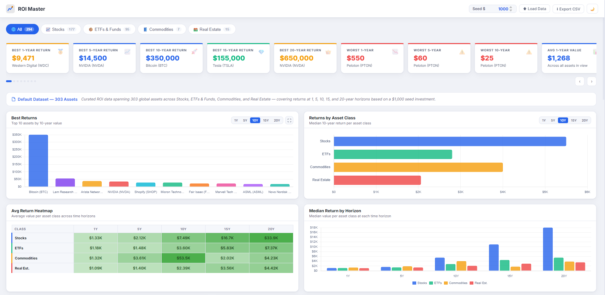
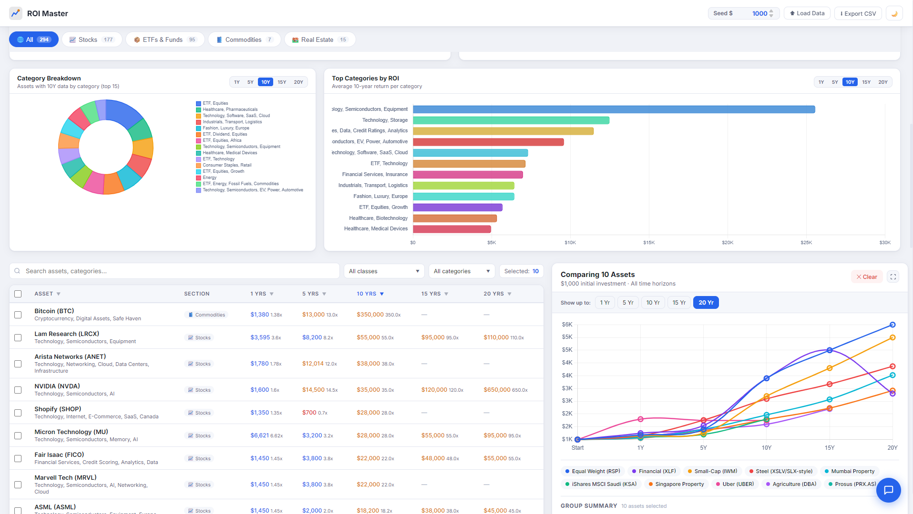
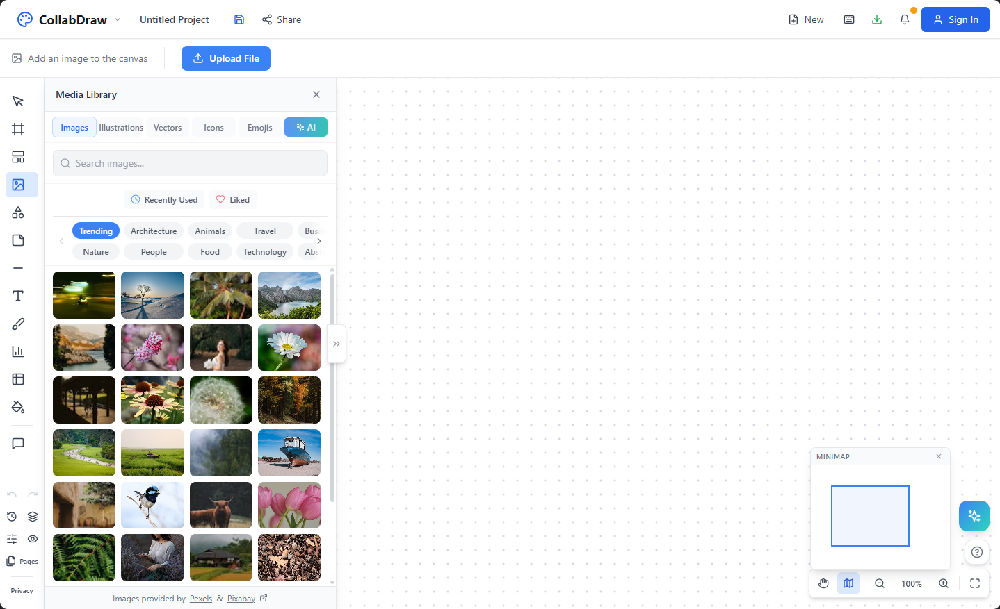

# ROI Master — Investment Dashboard

A tool that lets you see growth across investments and asset classes with advanced data visualisations and AI chat analysis. ***Easily add your own datasets.*** No login or backend required — fully client-side, runs entirely in the browser from a single HTML file. **Live Demo:** <a href="https://roimaster.netlify.app/" target="_blank">https://roimaster.netlify.app/</a>




**Live Demo:** <a href="https://roimaster.netlify.app/" target="_blank">https://roimaster.netlify.app/</a> — always reflects the latest `main` branch, deployed automatically.

**GitHub Repository:** <a href="https://github.com/QaunainM/ROI-Master" target="_blank">https://github.com/QaunainM/ROI-Master</a>

---

## Features

- **300+ pre-loaded assets** across Stocks, ETFs & Funds, Commodities, and Real Estate — ***easily add your own datasets*** via CSV upload
- **Adjustable seed value** — change the initial investment amount and all figures update instantly
- **Analyse with AI** — hover any of the 30 KPI tiles or any of the 7 data visualisations and a blue **Analyse with AI** button appears. Clicking it fires a pre-built, context-aware question directly into the chatbot — no typing needed. The question automatically reflects the active section, selected time horizon, and current data state
- **Dynamic Tooltips** — hover any of the 30 KPI tiles or any of the 7 data visualisations to see a live tooltip listing the **top 10 assets** that make up that specific data point. Every tooltip is generated on the fly from the current filtered dataset and active time horizon, so it always reflects exactly what you're looking at
- **Live reactive calculations** — every KPI tile and data visualisation instantly recalculates whenever you exclude assets or apply filters. Exclude a single outlier like Bitcoin, filter down to just ETFs, or run a free-text search — and every stat, chart, median, and ranked list updates in real time to reflect exactly the visible dataset, with no page reload required
- **30 KPI Tiles** — scrolling carousel of at-a-glance performance stats including:
  - Best 1Y, 5Y, 10Y, 15Y, and 20Y performer with name and return value
  - 10x Club, 25x Club, and 50x Club — counts of assets that hit each multiplier threshold
  - Dataset median return at each time horizon
  - Outlier detection — highlights assets significantly above or below the mean
  - Worst performer flags across each time horizon
- **Data Visualisations** — 7 interactive charts built with Chart.js 4:
  - **Best Returns (Bar Chart)** — top 10 assets by return value at any selected time horizon (1Y–20Y), with switchable range tabs
  - **Returns by Asset Class (Bar Chart)** — median return per asset class at any time horizon, letting you compare Stocks vs ETFs vs Commodities vs Real Estate at a glance
  - **Avg Return Heatmap** — colour-coded grid (green = strong ROI, red = underperformance) showing average return per asset class across all five time horizons simultaneously, with hover tooltips showing top-10 asset breakdowns per cell
  - **Median Return by Horizon (Grouped Bar / Line)** — median value per asset class at each time horizon side by side, revealing how different classes compound differently over time
  - **Category Breakdown (Donut Chart)** — asset count or average return by category (top 15), switchable by time horizon
  - **Top Categories by ROI (Horizontal Bar)** — average return ranked by category tag at any selected horizon, showing which sub-categories (AI, EV, Payments, etc.) lead
  - **ROI Growth Chart (Line Chart)** — interactive multi-asset comparison chart that appears when you select rows in the table; supports any number of assets simultaneously across 1Y–20Y horizons with a full-width expand mode
- **Full-featured Assets table** — sortable, searchable, paginated asset list with 1Y–20Y values and multipliers
- **Filter & search** — filter by asset class, category tags, or free-text search across all 300+ assets
- **Exclude rows** — temporarily remove assets from charts without deleting them
- **CSV import** — upload your own CSV to replace the default dataset
- **CSV export** — download the current filtered view as a CSV
- **AI Chat Assistant — answers in words *and* draws its own charts live** — ask a question and the assistant responds in plain English, then automatically renders a real bar chart right inside the chat bubble whenever the answer contains ranked or comparable data. No button to press, no separate view — the chart appears as part of the reply, on the fly. [Jump to full AI Chat section →](#ai-chat-assistant)
  - **Live in-chat chart generation** — Canvas-rendered horizontal bar chart injected directly into the message bubble for any ranked list, top-N result, or multi-asset comparison the AI produces
  - **Comparison charts** — side-by-side bars when the answer contrasts two groups (e.g. Asia vs Europe returns across time horizons)
  - **Voice readout (Web Speech API)** — every AI reply is read aloud using the browser's built-in `SpeechSynthesis` API with a prioritised natural female voice (Samantha, Google UK English Female, Karen, and others). A speaker icon in the chat header lets users mute/unmute at any time; the preference is saved to `localStorage` between visits
  - Auto-suggested follow-up questions — 6 contextual pills after every response, derived from the specific assets and topics in the answer
  - Persistent chat history — conversation is saved to localStorage and restored on return visits, with full chart replay
  - Full awareness of all 7 dashboard visualisations — ask "what does the scatter plot show?" and get a data-driven description
  - Powered by any OpenAI-compatible LLM, with automatic fallback to a smart regex engine when no API key is configured
  - Read-only guardrails — multiple layers prevent the chatbot from modifying data or being manipulated via prompt injection
- **Dark mode** — toggle between light and dark themes
- **Fully responsive** — works on desktop, tablet, and mobile
- **About modal** — hover the logo to access an About page

---

## Getting Started

### Option 1 — Open directly in a browser

No build step required. Just open `index.html` in any modern browser:

```
open index.html
```

### Option 2 — Local dev server (hot-reload)

```bash
npm install
npm run dev
```

Then visit `http://localhost:5173`.

---

## AI Chat Assistant

The built-in chat widget operates in two modes:

| Mode | When active | Behaviour |
|------|-------------|-----------|
| **AI mode** | `AI_Chat_LLM` environment variable is set | Sends questions to a serverless function which calls an LLM API and returns natural-language answers |
| **Smart mode** | No API key configured | Uses an enhanced local regex engine — asset lookups, performance summaries, category rankings, and structured data answers |

### Chat features

- **Analyse with AI buttons** — every KPI tile and every data visualisation has a hover-triggered **Analyse with AI** button. One click fires a contextual, pre-built question into the chat — no typing required. The question automatically incorporates the active section, selected time horizon, and current data state
- **Live in-chat charts** — whenever the AI's response contains a ranked list, top-N comparison, or side-by-side group breakdown, a Canvas-rendered horizontal bar chart is drawn automatically inside the message bubble — no button, no modal, no separate tab
- **Comparison charts** — when the AI contrasts two groups (e.g. Asia vs Europe across time horizons), the chart interleaves bars from both sides so the comparison is instantly visual
- **Voice readout (Web Speech API)** — each bot reply is spoken aloud via the browser's native `SpeechSynthesis` API. The voice picker prioritises natural, warm female voices (Samantha, Google UK English Female, Karen, etc.). A speaker icon in the chat header lets users mute/unmute; preference persists via `localStorage`
- **Dynamic follow-up pills** — after every AI response, 6 contextual follow-up questions appear as clickable pills derived from the specific assets, categories, and time horizons mentioned in the reply. These are generated dynamically from the conversation context — not a fixed list. Each response produces different pills tailored to what was just discussed (e.g. after asking about tech stocks you might see pills for semiconductors, AI ETFs, or 10-year comparisons). The opening quick-question pills are also randomised on each visit from a pool of 35+ investment topics

- **Persistent history** — the full conversation is saved to localStorage and restored on return, with charts replayed from stored data
- **Visualisation awareness** — the chatbot knows the names and purpose of all 7 dashboard charts and describes what each shows using live dataset figures
- **Guardrails** — three layers of protection: client-side input blocking, server-side pattern matching, and a hardened system prompt that enforces read-only behaviour and resists prompt injection
- **IP rate limiting** — each unique IP address is limited to 30 AI calls per UTC day, tracked server-side via the hosting platform's key-value store. This cannot be bypassed by clearing browser storage. The chat counter shows remaining messages; users who hit the limit see a message directing them to the site owner

### Enabling AI on your own deployment

1. Fork this repository and connect it to your hosting platform
2. Add a new environment variable:
   - **Key:** `AI_Chat_LLM`
   - **Value:** your API key from any OpenAI-compatible LLM provider
3. Deploy the site — the chat badge will show **AI** instead of **Basic**

> **Not using Netlify?** See [Alternatives to Netlify](#alternatives-to-netlify-for-hosting-the-ai-function) for step-by-step instructions for Supabase, Firebase, Cloudflare Workers, AWS Lambda, Coolify, and others.

### Alternatives to Netlify for hosting the AI function

If you don't want to use Netlify, the `netlify/functions/chat-ai.js` serverless function can be ported to any Node.js-compatible serverless platform with minimal changes:

| Platform | How to adapt |
|----------|-------------|
| **Cloudflare Workers** | Rewrite using the Workers fetch event pattern. Store the API key as a Worker secret via `wrangler secret put AI_Chat_LLM`. Replace Netlify Blobs with Cloudflare KV for rate limiting. |
| **AWS Lambda** | The function already uses `exports.handler` — deploy as-is. Store the key in AWS Secrets Manager or as a Lambda environment variable. Replace Netlify Blobs with DynamoDB for rate limiting. |
| **Supabase Edge Functions** | Rewrite as a Deno function using `Deno.serve`. Store `AI_Chat_LLM` as a Supabase secret. Use a Supabase Postgres table or Supabase KV for rate limiting. |
| **Firebase (Cloud Functions)** | Export as `exports.chatAi = functions.https.onRequest(handler)`. Store the key via `firebase functions:config:set`. Use Firestore for rate limiting. |
| **Coolify** | Deploy as a Node.js Express app on your self-hosted Coolify instance. Set `AI_Chat_LLM` as an environment variable in the Coolify UI. Use Redis or a Postgres table for rate limiting. |
| **Railway / Render / Fly.io** | Deploy as a small Express or Hono server. Point `AI_ENDPOINT` in `public/chat.js` to your deployed URL. |
| **Self-hosted VPS** | Run a minimal Node.js Express server on any VPS (DigitalOcean, Linode, Hetzner). Set `AI_Chat_LLM` as a system environment variable. |

The only requirement is that the endpoint accepts `POST { message, assetContext, conversationHistory }` and returns `{ reply, ai_available, remaining_calls }`.

> **Note:** IP rate limiting uses `@netlify/blobs`, which is a Netlify-specific feature. If you port to another platform, replace the blob store calls with your own key-value store (Redis, Upstash, DynamoDB, etc.) or remove the rate limiting if not needed. See [IP Rate Limiting](#ip-rate-limiting) below for full details.

### IP Rate Limiting

The serverless function enforces a per-IP daily call limit to prevent a single user from exhausting your LLM API credits.

**How it works:**

- Each incoming request carries the caller's IP address (read from `x-nf-client-connection-ip`, then `x-forwarded-for`).
- The IP is used as a key in a store called `chat-rate-limits`. Each key stores `{ date, count }` — today's UTC date and how many calls that IP has made.
- On every AI request, the count is incremented. If it reaches `DAILY_LIMIT` (default: 30), the request is blocked and the frontend shows a limit-reached message.
- The limit resets automatically at UTC midnight — no cron job needed, because the stored date is compared to today's date on every call.
- The call counter in the chat UI updates in real time so users can see how many messages they have left.

**Changing the daily limit:**

Open `netlify/functions/chat-ai.js` and update the constant near the top:

```js
const DAILY_LIMIT = 30; // change to any number you want
```

**Replacing Netlify Blobs with another store:**

Netlify Blobs is only available on Netlify. If you host elsewhere, replace the two rate-limiting helper blocks in `chat-ai.js` with any key-value store. The interface is simple — you need just two operations:

```js
// READ: get the current record for an IP
const record = await store.get(ip, { type: 'json' });
// record is either null or { date: "YYYY-MM-DD", count: N }

// WRITE: save the updated count
await store.setJSON(ip, { date: today, count: newCount });
```

Drop-in replacement options:

| Store | Notes |
|-------|-------|
| **Upstash Redis** | Free tier, HTTP API, works in any serverless runtime |
| **Cloudflare KV** | Ideal if porting to Cloudflare Workers |
| **DynamoDB** | AWS-native, pairs naturally with Lambda |
| **Supabase / Postgres** | Use a simple `ip_rate_limits` table with an upsert |
| **Firebase / Firestore** | Use a `rate_limits` collection; upsert by IP doc ID |
| **Neon (Postgres)** | Serverless Postgres with HTTP API — simple `INSERT … ON CONFLICT DO UPDATE` upsert by IP |
| **In-memory (Map)** | Only suitable for single-instance, non-production use |

**Removing rate limiting entirely:**

If you don't want any rate limiting, delete the rate-limit block in `chat-ai.js` (the section between `// ── IP Rate Limiting` and the `if (!rateLimitOk)` block), set `remainingCalls = DAILY_LIMIT`, and remove the `connectLambda(event)` call. You can also remove `@netlify/blobs` from `package.json` and the `external_node_modules` line from `netlify.toml`.

---

### Swapping the LLM provider

Open `netlify/functions/chat-ai.js` and update the two constants at the top of the file to point at your chosen provider's endpoint and model name:

```js
const LLM_API_URL = 'https://<your-provider>/v1/chat/completions';
const MODEL = '<model-name>';
```

Any provider that implements the OpenAI `/v1/chat/completions` format will work — including OpenAI, Anthropic-compatible proxies, Mistral, Groq, Together AI, and others.

---

## Deploying to Netlify

This project includes a `netlify.toml` that configures:
- **Publish directory:** `.` (the repo root, where `index.html` lives)
- **Functions directory:** `netlify/functions`
- **Node version:** 18

To deploy:
1. Fork the repo and connect it to a new Netlify site
2. Netlify will detect `netlify.toml` automatically — no manual settings required
3. Optionally add the `AI_Chat_LLM` environment variable to enable AI chat

Every push to `main` triggers an automatic redeploy.

---

## Using Your Own Data

### Option 1 — CSV upload

Click **Load Data** in the top toolbar to upload a CSV file. The CSV must follow this column structure:

| Column | Description |
|--------|-------------|
| 1 | Asset / Company name |
| 2 | Category (e.g. `Technology, Semiconductors`) |
| 3 | 1Y Value (based on seed) |
| 4 | 1Y Growth multiplier (x) |
| 5 | 5Y Value |
| 6 | 5Y Growth multiplier (x) |
| 7 | 10Y Value |
| 8 | 10Y Growth multiplier (x) |
| 9 | 15Y Value |
| 10 | 15Y Growth multiplier (x) |
| 11 | 20Y Value |
| 12 | 20Y Growth multiplier (x) |

- Row 1 is the header row and is ignored
- Values should be based on a **$1,000 seed investment** (the seed amount is adjustable in the UI)
- Missing values (no data for that time horizon) should be left blank
- Click the **Download sample CSV** link inside the Load Data tooltip to get a template

To revert to the built-in dataset, click **Reset to default**.

### Option 2 — Connect a live data API

Instead of uploading a CSV, you can feed live or custom data by replacing the static dataset at runtime. Some approaches:

**Financial data providers**
- Fetch from <a href="https://finance.yahoo.com/" target="_blank">Yahoo Finance</a> (unofficial API), <a href="https://www.alphavantage.co/" target="_blank">Alpha Vantage</a>, or <a href="https://polygon.io/" target="_blank">Polygon.io</a> inside a small serverless function. Map the returned OHLC / price history to the CSV column structure and call `loadDataFromArray(rows)` in `public/data.js`.

**Your own database**
- Expose a REST endpoint (e.g. from Supabase, Firebase, or a Postgres instance) that returns JSON in the same shape as the CSV rows. Fetch it on page load and pass it to `window.masterData` before `app.js` initialises.

**Google Sheets**
- Publish a Sheet as CSV (File → Share → Publish to web → CSV). Pass that URL to `Papa.parse(url, { download: true, ... })` and use the result as your dataset. This lets non-technical users maintain the data in a spreadsheet.

**CMS or headless API**
- If your asset data lives in Contentful, Airtable, or a similar CMS, fetch the entries via their REST/GraphQL API, transform them to match the expected column order, and inject them before page render.

The key contract is: supply an array of rows where each row matches the 12-column CSV format (name, category, v1, g1, v5, g5, v10, g10, v15, g15, v20, g20).

---

## CSV Format Example

```csv
Asset Name,Category,1Yr Value,1Yr Growth (x),5Yr Value,5Yr Growth (x),10Yr Value,10Yr Growth (x),15Yr Value,15Yr Growth (x),20Yr Value,20Yr Growth (x)
Apple (AAPL),Stocks,1380,1.38,2850,2.85,9200,9.20,28000,28.00,68000,68.00
Vanguard Total Market ETF (VTI),ETFs & Funds,1240,1.24,1770,1.77,3150,3.15,5800,5.80,9200,9.20
Gold ETF (GLD),Commodities,1080,1.08,1350,1.35,1820,1.82,2400,2.40,3200,3.20
```

---

## Project Structure

```
├── index.html                          # Single-page app entry point (About is a modal at /about)
├── netlify.toml                        # Netlify build + functions config
├── netlify/
│   └── functions/
│       └── chat-ai.js                  # AI chat proxy (serverless function)
├── public/
│   ├── app.js                          # All application logic
│   ├── chat.js                         # Chat widget (AI + smart fallback)
│   ├── style.css                       # All styles
│   └── data.js                         # Default dataset (300+ assets)
├── Master_Investment_Table_303_Assets_-_V2.csv   # Source data reference
├── package.json                        # Only dependency: Vite (optional, for local dev)
└── vite.config.ts                      # Minimal Vite config
```

---

## Tech Stack

| Layer | Technology |
|-------|-----------|
| UI | Vanilla HTML + CSS (no framework) |
| Logic | Vanilla JavaScript (ES2020) |
| Charts | <a href="https://www.chartjs.org/" target="_blank">Chart.js 4</a> via CDN — no need to download anything |
| In-chat charts | Canvas API (no dependencies) |
| Voice readout | Web Speech API (`SpeechSynthesis`) — built into modern browsers, no library needed |
| Fonts | Inter (Google Fonts) |
| AI Chat | OpenAI-compatible LLM API (provider of your choice) |
| Hosting | Netlify (host wherever you want) |

**No React. No TypeScript. No databases. No backend. No build step required for end users.**

---

## Forking & Contributing

1. Fork this repository on GitHub
2. Clone your fork: `git clone https://github.com/YOUR_USERNAME/ROI-Master.git`
3. Open `index.html` directly **or** run `npm install && npm run dev` and visit `http://localhost:5173`
4. Make your changes in `public/app.js`, `public/style.css`, `public/chat.js`, or `index.html`
5. To enable AI chat on your fork, add the `AI_Chat_LLM` environment variable to your hosting platform's environment settings. If you're not using Netlify, see the [Alternatives to Netlify](#alternatives-to-netlify-for-hosting-the-ai-function) section for platform-specific instructions
6. Submit a pull request with a clear description of what you changed

All logic lives in `public/` (vanilla JS). There is no compile step, so edits are immediately visible on page refresh.

You don't need to credit me, but I'm always grateful when you do. Either way, drop me a message so I can see your forks — and let me know any feedback! Reach me via <a href="https://www.qaunain.com" target="_blank">qaunain.com</a> or <a href="https://www.linkedin.com/in/qaunainm/" target="_blank">LinkedIn</a>.

---

## Creator

**Qaunain Meghjee**


As someone who invests across multiple asset classes, I needed a clear way to visualise long-term growth and compare ROI statistics side by side — so I built ROI Master.

15 years of experience launching products and features across AI, web, mobile, eCommerce, SaaS, API platforms, and IoT. Specialist in product management, technology, automation, and user engagement. Helping companies implement AI and ML since 2016.

- **Website:** <a href="https://www.qaunain.com" target="_blank">www.qaunain.com</a>
- **LinkedIn:** <a href="https://www.linkedin.com/in/qaunainm/" target="_blank">linkedin.com/in/qaunainm</a>

---

## Also by the same creator — CollabDraw

[](https://www.CollabDraw.com)

**[CollabDraw](https://www.CollabDraw.com)** is a real-time collaborative UX and design canvas — an infinite workspace where teams can design, draw, and create together live.

Key features:
- **Infinite canvas** with real-time multiplayer (see your teammates' cursors live)
- **Full media library** — millions of images, icons, and assets ready to drop in
- **AI image generation** — generate visuals directly on the canvas
- **Charts, shapes, and diagramming tools** built in
- **Hundreds of templates** to get started instantly
- No install required — works in the browser

**[Try CollabDraw free →](https://www.CollabDraw.com)**

---

## License

MIT — free to use, fork, and modify.

---

ROI Master — AI chat analysis and 40 data visualisations across investments and asset classes. Upload your own data. Made by <a href="https://www.qaunain.com" target="_blank">Qaunain Meghjee</a>. <a href="https://github.com/QaunainM/ROI-Master" target="_blank">Clone this on GitHub</a>. Also check out <a href="https://www.CollabDraw.com" target="_blank">CollabDraw</a> — real-time collaborative design canvas.
